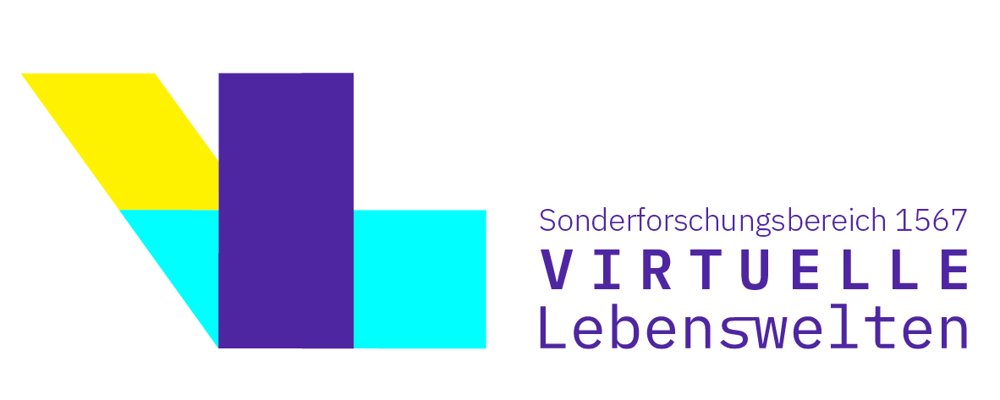

**Candy speech detection is an official [GermEval shared task](https://germeval.github.io/) co-located with the [KONVENS 2025](https://konvens-2025.hs-hannover.de/) conference.** 

[Data](#data)\
[Important dates](#dates)

### Background 

The task is to identify expressions of candy speech („Flausch“) in online posts (YouTube comments).
We define candy speech as expression of positive attitudes on social media toward individuals or their output (videos, comments, etc.).
The purpose of candy speech is to encourage, cheer up, support and empower others. 
It can be viewed as the counterpart to hate speech, as it also aims to influence the self-image of the target person or group, but in a positive way.

### Motivation

Numerous methods have been developed for detecting and censoring negative speech (e.g., hate speech or offensive or harmful language) on social media platforms. 
However, there is much less focus on identifying and promoting positive supportive discourse in online communities. Our shared task aims to address this gap and encourage researchers to focus on such positive expressions.

### Task Details

Candy speech detection is the task of identifying the presence of candy speech (on the span level) in a given YouTube comment and classifying each such expression in one of the predefined categories. 
This shared task focuses on German speaking YouTube communities. Participants will be provided with a dataset of YouTube comments manually annotated for different types of candy speech. 

The shared task includes the following two subtasks:

#### Subtask 1: Coarse-Grained Classification
The goal of this task is to identify whether the given comment contains candy speech or not. The dataset is manually annotated for the presence of candy speech (binary classification task).

#### Subtask 2: Fine-Grained Classification
The goal of this subtask is to identify the span of each candy speech expression in a given comment and classify it into one of the predefined categories. The dataset is manually annotated for ten different types of candy speech expressions, such as "positive feedback", "compliment", "group membership" etc.

### Approaches and Evaluation

Please note that we see the shared task not primarily as a pure (machine learning) engineering task, but as an opportunity for computational linguistic exploration. We therefore encourage participants to focus on the creative use of (linguistic) analysis, approaches, tools, and external ressources.

In principle, all model types and approaches are allowed, but we prefer the use of open-source systems and models and freely available ressources to facilitate reproducibility.

All submissions will be evaluated by the shared task organizers. We provide evaluation scripts based on precision, recall and f1 score (available with the data as specified below). The primary evaluation metric will be f1 score for Subtask 1 and a strict span-based f1 score for Subtask 2, though other metrics will be provided and analyzed to judge submissions and for development. 

### Data {#data}

We will provide the participants with the annotated training (and development) and unlabeled test datasets containing complete written, German language comment threads under YouTube videos posted by different content creators. 
The content creators and communities vary in topic, style, age group, etc. 
The training and test datasets do not overlap in terms of YouTube videos. Furthermore, the test dataset mostly contains (comments on) videos from content creators that differ from those in the training dataset. The communities commenting on these videos can therefore be expected to vary.

 
**The data for the shared task is hosted on [OSF](https://osf.io/4g8zb/).**

#### Sample Data

 
<table>
<thead>
<tr class="header">
<th>YouTube comment</th>
<th>Candy speech (Subtask 1)</th>
<th>Candy speech type (Subtask 2)</th>
</tr>
</thead>
<tbody>
<tr>
<td markdown="span">hahahahah voll cool . der lehrer hat auswehrsehen das video angeklickt war voll geil</td>
<td markdown="span">yes</td>
<td markdown="span">positive feedback [hahahahah voll cool],[war voll geil]</td>
</tr>
<tr>
<td markdown="span">lehrer neven ganz übel ich beebde den unterricht ( facepalm )</td>
<td markdown="span">no</td>
<td markdown="span"> </td>
</tr>
<tr>
<td markdown="span">cool wie immer . Macht weiter so :)</td>
<td markdown="span">yes</td>
<td markdown="span">positive feedback [cool wie immer]; encouragement [Macht weiter so :)]</td>
</tr>
<tr>
<td markdown="span">+ Lu Spindler ran an die Sportklamotten ! 😁</td>
<td markdown="span">no</td>
<td markdown="span"> </td>
</tr>
<tr>
<td markdown="span">Omg 😍 omg 😍 omg 😍 das video ist einfach so shönn geworden aww deine augen sind so sc Hönn 😍 😍 ich liebe diich und deine videos yoh sehr ❤ love you LuNa 😍 😘</td>
<td markdown="span">yes</td>
<td markdown="span">positive feedback [Omg 😍 omg 😍 omg 😍], [das video ist einfach so shönn geworden]; compliment [aww deine augen sind so sc Hönn 😍 😍]; positive feedback/affection declaration [ich liebe diich und deine videos yoh sehr ❤]; affection declaration [love you LuNa 😍 😘]</td>
</tr>
</tbody>
</table>

### Important dates {#dates}

- Trial data available: February 15, 2025
- Training data available: March 3, 2025
- Test data available: June 10, 2025
- Evaluation start: June 16, 2025
- Evaluation end: June 27, 2025
- Paper submission due: July 11, 2025
- Camera ready due: August 15, 2025
- GermEval workshop: September 10, 2025 (co-located with KONVENS)

All deadlines are 00:00 UTC+0.

### Participation

You can register on CodaBench for the subtask you want to participate in: [Subtask 1](https://www.codabench.org/competitions/6120/)/[Subtask 2](https://www.codabench.org/competitions/7921/)

### Organizers

- [Yulia Clausen](https://www.virtuelle-lebenswelten.de/early-career-forum/clausen-yulia/), Ruhr-Universität Bochum, Germany
- [Tatjana Scheffler](http://staff.germanistik.rub.de/digitale-forensische-linguistik/), Ruhr-Universität Bochum, Germany
- [Michael Wiegand](https://homepage.univie.ac.at/michael.wiegand/), Universität Wien, Austria

__Contact:__ <germeval-2025-candy-speech@ruhr-uni-bochum.de>

This shared task is conducted as part of the project D03, [CRC 1567 "Virtual Lifeworlds"](https://www.virtuelle-lebenswelten.de/).

